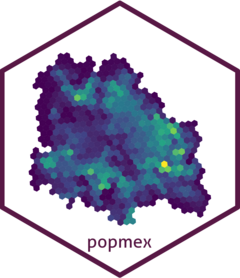

<!-- README.md is generated from README.Rmd. Please edit that file -->

```{r, include = FALSE}
knitr::opts_chunk$set(
  collapse = TRUE,
  comment = "#>",
  fig.path = "man/figures/README-",
  out.width = "100%"
)
```

# popmex

<!-- badges: start -->
<!-- badges: end -->



The goal of the popmex package is to provide spatial population dataset at different levels of resolution.

- hdx_pop2023. Population Density for 400m H3 Hexagons of Mexico for 2022

- hdx_pop2023. Population Density for 400m H3 Hexagons of Mexico for 2023.

## Installation

The development version of the densnv package is hosted on [GitHub](https://github.com/) and can be installed in R with several packages: [devtools](https://devtools.r-lib.org), [remotes](https://remotes.r-lib.org), [renv](https://rstudio.github.io/renv/articles/renv.html) and [pak](https://pak. r-lib.org).

``` r
# install.packages("pak")
#pak::pkg_install("fdzul/popmex")
```

## Credits

The spatial dataset provided in the package were accessed from the
HUMANITARIAN DATA EXCHANGE [HDX] page (https://data.humdata.org)


## License

This project is licensed under the MIT license - see the file [LICENSE.md](LICENSE.md) for more details.

## Inspiration

The spatial dataset provided by the package were inspired by the need to contribute to decision making in programs
of Vector Transmitted Diseases (VTE) and Arthropod Venom Intoxication (IVA) of the CENAPRECE of the Secretary of Health of Mexico


## Help.

If you find a bug in the code, please submit a minimal reproducible example on [github](https://github.com/fdzul/popmex/issues). For questions and other discussions, do not hesitate to contact me (felipe.dzul.m@gmail.com)

-----
Please note that this project is published with a [Code of
Conduct](https://dplyr.tidyverse.org/CODE_OF_CONDUCT). By participating in this project you agree to comply with its terms.
